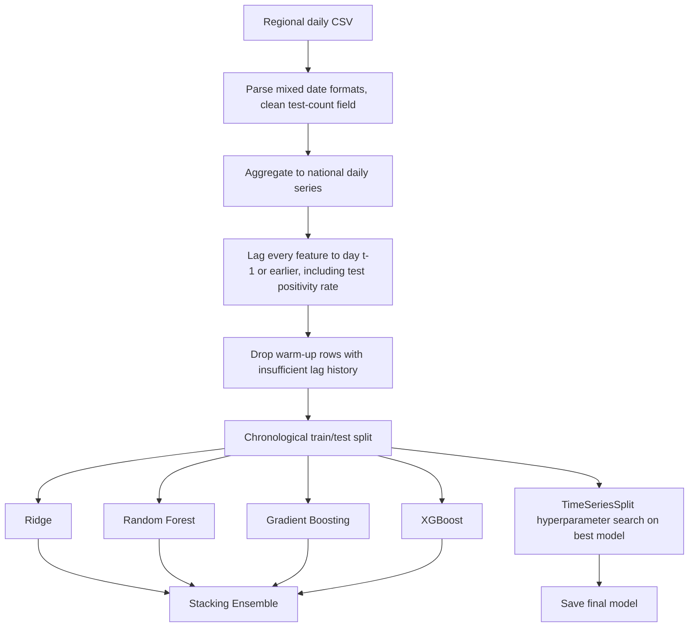

# 🦠 COVID-19 Pakistan: Daily New Case Forecasting


A time-series regression pipeline that forecasts Pakistan's next-day national COVID-19 case count from 2020 regional case data, with every engineered feature built strictly from information available up to the previous day.

## 🧠 Why This Exists

Time-series forecasting has a leakage mode that's easy to miss: a feature can look lagged in spirit while still being computed from same-day cumulative totals. `cumulative_test_positive` and `cumulative_tests` on day t already include day t's own confirmed cases and tests, so a same-day test positivity rate is partly a function of the value being predicted. That link is real — a same-day positivity rate correlates with the same day's new case count at roughly 0.36 — even though it never touches the target column directly.

- **Fully lagged feature set**: every feature, including test positivity rate, is shifted to use only prior-day or earlier information
- **Chronological split**: train/test boundary is a real point in time, not a random shuffle, so the test set is a genuine future window
- **`TimeSeriesSplit` for tuning**: hyperparameter search respects temporal order; the stacking ensemble's internal folds are documented as a deliberate, disclosed exception since `StackingRegressor` requires folds that fully partition the data
- **Five models compared**: Ridge, Random Forest, Gradient Boosting, XGBoost, Stacking Ensemble

## 🚀 Quickstart

```bash
git clone <repo-url>
cd covid19-pakistan-forecasting
pip install -r requirements.txt
jupyter notebook covid19_pakistan_forecasting.ipynb
```

Run all cells top to bottom. The notebook reads `data/covid-19-cases-in-pakistan-2020.csv` and writes plots to `plots/` and the final model to `models/`, both relative to its own location.

## 🏗️ Architecture

**Stack**: pandas, NumPy, scikit-learn, XGBoost, matplotlib, seaborn, joblib.



## 📊 Data & Model Details

**Dataset**: Pakistan COVID-19 case reports, March-June 2020, reported per region per day. Aggregated to 90 national daily rows, then reduced to 83 rows once lag and rolling-window features have enough history.

**Features**: calendar position (day of week, days since start), lagged new-case counts (1, 2, 3, 7 days), 3-day and 7-day rolling mean/std of new cases, lagged testing volume, lagged growth rate, lagged test positivity rate — 12 features total, all using information available no later than the previous day.

| Model | MAE | RMSE | R² |
|---|---|---|---|
| **Ridge** | **3,795.96** | **4,425.53** | **0.629** |
| Stacking Ensemble | 5,172.68 | 6,165.32 | 0.280 |
| Gradient Boosting | 5,903.94 | 7,654.29 | -0.110 |
| XGBoost | 6,088.38 | 7,758.19 | -0.141 |
| Random Forest | 6,090.16 | 7,764.09 | -0.142 |

Ridge is the strongest model by a wide margin on this 83-row series — the tree-based models overfit a dataset this small. After `TimeSeriesSplit` tuning (`alpha=10.0`), Ridge reaches RMSE 4,227 and R² 0.661 on the held-out window. Feature importance from the tree models confirms `positivity_rate_lag1` contributes almost nothing (under 1% average importance), so lagging it changed the leakage exposure without materially changing which signals the model actually relies on: 7-day rolling mean and days-since-start dominate.

## 📁 Repository Structure

```
covid19-pakistan-forecasting/
├── covid19_pakistan_forecasting.ipynb
├── data/
│   └── covid-19-cases-in-pakistan-2020.csv
├── requirements.txt
└── README.md
```

## 🤝 Contribution & License

Issues and PRs welcome. Licensed under MIT.
